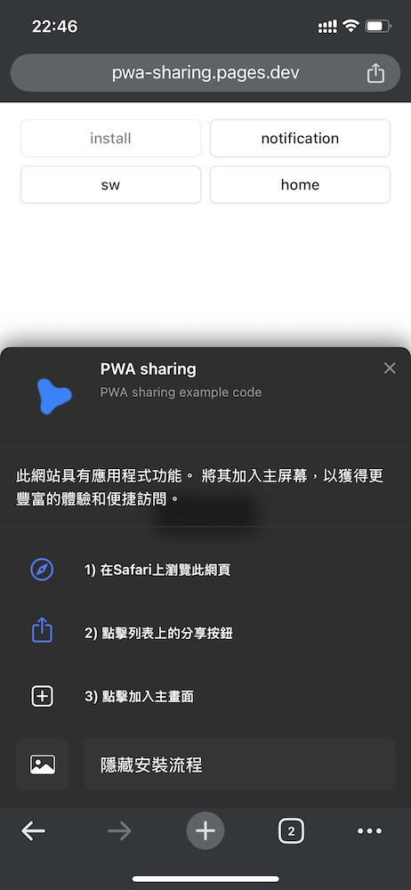

### [介紹](#intro)

Web Manifest 是一個 JSON 格式的設定檔，可以用來定義 Web App 安裝時顯示的資訊與設定安裝後啟動 Web App 的介面，
[範例網站](https://pwa-sharing.pages.dev/) 可以參考實際上在不同裝置上會如何呈現，範例網站的程式碼解說參考 [這篇](/article/pwa/example/) 文章。

Web Manifest 設定比起說明看到實際顯示的畫面更容易了解，所以這篇會使用大量截圖。

### [範例](#example)

參考 PWA sharing 的 [Web manifest](https://pwa-sharing.pages.dev/manifest.webmanifest) 更容易理解這些屬性，下面挑了一些支援度相當高的屬做說明，影響 Web App 很明顯建議都要設定。

`screenshots` 與 `icons` 內容比較複雜底下另外做說明。

#### 基本設定

```json
{
  "name": "PWA sharing Web App",
  "short_name": "PWA sharing",
  "description": "PWA sharing example code",
  "scope": "/",
  "start_url": "/",
  "display": "standalone",
  "background_color": "#ffffff",
  "theme_color": "#51a2ff",
  "icons": [],
  "screenshots": []
}
```

- name
  > 完整名稱，安裝成 Web App 後裝置的應用程式、應用程式的清單裡或啟動 Web App 的畫面上 `可能` 會顯示這個名稱，建議與 `short_name` 一致
- short_name
  > 顯示在桌面上的 Web App 名稱，只有一個圖示的寬度，所以要短一點
  <table data-center>
    <tr>
      <td>macOS</td>
      <td>iOS</td>
    </tr>
    <tr>
      <td>
        
      </td>
      <td>
        
      </td>
    </tr>
  </table>
- description
  > Web App 的描述，像是 App 商店裡用於描述這個程式的用途，在豐富的安裝使用者介面會顯示在 UI 上
  <div>
    
  </div>
- scope
  > 指定 Web App 的適用範圍，例如網站是 `https://example.com` 但是開始接受安裝成爲 Web App 的是另外開發的網站放在 `https://example.com/app` 路徑時可以指定成 `/app`
- start_url
  > 指定未開啟的 Web App 開起來時預設要開哪一個頁面，通常首頁可以直接放 `/`
- display
  > 決定安裝成 Web App 時的應用程式外框
  <table data-center>
    <tr>
      <td>standalone</td>
      <td>
        
      </td>
    </tr>
    <tr>
      <td>minimal-ui</td>
      <td>
        
      </td>
    </tr>
  </table>
- background_color
  > Web App 尚未載入前空白畫面預設的背景色
- theme_color

  > 主題顏色會影響 Web App 頂部 URL 介面區塊的顏色，需要 dark mode 的時候可以在 HTML 加上 meta 根據主題顏色動態切換
  >
  > [MDN combind with media query](https://developer.mozilla.org/en-US/docs/Web/Progressive_web_apps/Manifest/Reference/theme_color#description)

  自訂 dark / light 模式下的主題顏色

  ```html
  <meta
    name="theme-color"
    content="#51a2ff"
    media="(prefers-color-scheme: light)"
  />
  <meta
    name="theme-color"
    content="#162556"
    media="(prefers-color-scheme: dark)"
  />
  ```

  <table data-center>
    <tr>
      <td>macOS light</td>
      <td>
        
      </td>
    </tr>
    <tr>
      <td>macOS dark</td>
      <td>
        
      </td>
    </tr>
    <tr>
      <td>iOS light</td>
      <td>
        
      </td>
    </tr>
    <tr>
      <td>iOS dark</td>
      <td>
        
      </td>
    </tr>
  </table>

### [圖示](#icons)

安裝到不同裝置上顯示的圖示會是不同尺寸，建議直接用網站的圖示透過其他工具產生對應大小的圖片，PWA sharing 用的 Vite PWA 有提供一個 CLI 工具 `@vite-pwa/assets-generator` ，可以產生不同尺寸的圖示與啟動畫面，設定方式參考 [官方文件](https://vite-pwa-org.netlify.app/assets-generator/) 和 PWA sharing 設定 [pwa-assets.config.js](https://github.com/sky172839465/pwa-sharing/blob/main/pwa-assets.config.js)

```json
[
  {
    "src": "pwa-64x64.png",
    "sizes": "64x64",
    "type": "image/png"
  },
  {
    "src": "pwa-192x192.png",
    "sizes": "192x192",
    "type": "image/png"
  },
  {
    "src": "pwa-512x512.png",
    "sizes": "512x512",
    "type": "image/png"
  },
  {
    "src": "pwa-512x512.png",
    "sizes": "512x512",
    "purpose": "any",
    "type": "image/png"
  },
  {
    "src": "maskable-icon-512x512.png",
    "sizes": "512x512",
    "purpose": "maskable",
    "type": "image/png"
  }
]
```

<table data-center>
  <tr>
    <td>macOS</td>
    <td>Win10</td>
    <td>iOS</td>
    <td>Android</td>
  </tr>
  <tr>
    <td>
      
    </td>
    <td>
      
    </td>
    <td>
      
    </td>
    <td>
      
    </td>
  </tr>
</table>

### [豐富的安裝介面](#rich-install)

透過 `screenshots` 屬性可以在安裝時顯示 Web App 的預覽圖，Windows & macOS 支援度比較高

> 注意：描述 `description` 也需要有設定 `screenshots` 才會在安裝時一起顯示，否則只會有網站名稱

Windows & macOS 在 chrome 上顯示的安裝界面一致

<div>
  
</div>

```json
[
  {
    "src": "rich-install/0_desktop-home.png",
    "label": "PWA sharing 0_desktop-home",
    "form_factor": "wide",
    "sizes": "1600x919",
    "type": "image/png"
  },
  {
    "src": "rich-install/1_desktop-sw.png",
    "label": "PWA sharing 1_desktop-sw",
    "form_factor": "wide",
    "sizes": "1600x919",
    "type": "image/png"
  },
  {
    "src": "rich-install/2_desktop-notification.png",
    "label": "PWA sharing 2_desktop-notification",
    "form_factor": "wide",
    "sizes": "1600x919",
    "type": "image/png"
  },
  {
    "src": "rich-install/0_mobile-home.png",
    "label": "PWA sharing 0_mobile-home",
    "form_factor": "narrow",
    "sizes": "772x1568",
    "type": "image/png"
  },
  {
    "src": "rich-install/1_mobile-sw.png",
    "label": "PWA sharing 1_mobile-sw",
    "form_factor": "narrow",
    "sizes": "772x1568",
    "type": "image/png"
  },
  {
    "src": "rich-install/2_mobile-notification.png",
    "label": "PWA sharing 2_mobile-notification",
    "form_factor": "narrow",
    "sizes": "772x1568",
    "type": "image/png"
  }
]
```

### [客製化的安裝介面](#custom-rich-install)

會需要客製化的原因有兩個

1. 行動裝置上也有顯示 Web App 預覽圖可以讓使用者更容易了解安裝的目的
1. 加入安裝引導，iOS 上並不叫安裝而是 `加入主畫面`，所以最好有引導告訴使用者如何安裝 Web App

<table data-center>
  <tr>
    <td>macOS</td>
    <td>iOS</td>
    <td>Android</td>
  </tr>
  <tr>
    <td>
      
    </td>
    <td>
      
    </td>
    <td>
      
    </td>
  </tr>
</table>

### [參考](#reference)

- [MDN Web app manifests](https://developer.mozilla.org/en-US/docs/Web/Progressive_web_apps/Manifest)
- [Vite PWA](https://vite-pwa-org.netlify.app/)
- [Vite PWA @vite-pwa/assets-generator](https://vite-pwa-org.netlify.app/assets-generator/)
- [PWA sharing](https://pwa-sharing.pages.dev)
- [PWA sharing source code](https://github.com/sky172839465/pwa-sharing)
