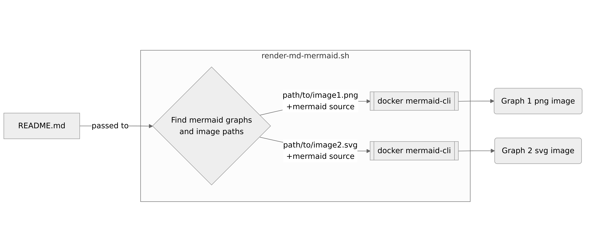
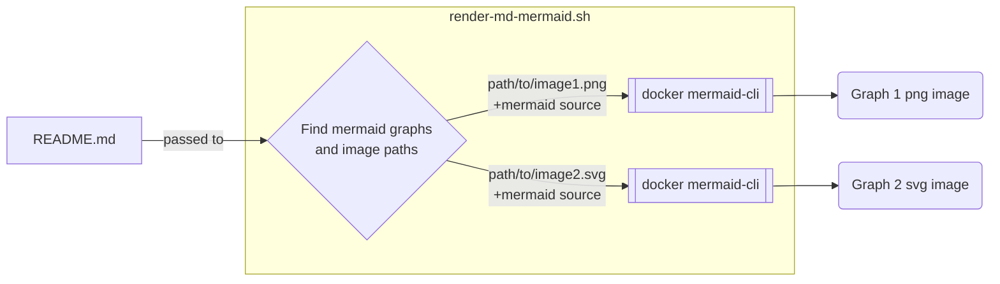

# This is Lazy

Lazy Vite SKIP AUTO WWW UPDATED!!! AGAIN OK DONNNNEEEE GOOD FINIALLY ? WAITING PWAAA TRACEEEEE NEW AGAIN is an opinionated web dev build tool that serves your code via native ES Module imports during dev and bundles it with Rollup for production.

```js
collect.push({
  isMarkdown,
  markdown: isMarkdown ? page() : undefined,
  filePath: path,
  path: isIndex ? "/" : `${normalizedPathName.toLowerCase()}/`,
  element: isMarkdown ? undefined : lazy(page),
  layout: layout ? lazy(layout) : undefined,
  loader: pageLoader
    ? (...args) => pageLoader().then((module) => module.default(...args))
    : null,
});
```


## [I am not sure...](#test3)

Lazy Vite is an opinionated web dev build tool that serves your code via native ES Module imports during dev and bundles it with Rollup for production.

```javascript
const FILE_NAME = {
  MAIN: "index.jsx",
  LOADER: "index.loader.js",
  LAYOUT: "index.layout.jsx",
};
```

# One morning, when Gregor Samsa woke from troubled dreams.

One morning, when Gregor Samsa woke from troubled dreams, he found himself _transformed_ in his bed into a horrible [vermin](http://en.wikipedia.org/wiki/Vermin "Wikipedia Vermin"). He lay on his armour-like back, and if he lifted his head a little he could see his brown belly, slightly domed and divided by arches into stiff sections. The bedding was hardly able to cover **strong** it and seemed ready to slide off any moment. His many legs, pitifully thin compared with the size of the rest of him, link waved abouthelplessly as he looked. <cite>“What's happened to me?”</cite> he thought. It wasn't a dream. His room, a proper human room although a little too small, lay peacefully between its four familiar walls.</p>


## [The bedding was hardly able to cover it.](#test1)

It showed a lady fitted out with a fur hat and fur boa who sat upright, raising a heavy fur muff that covered the whole of her lower arm towards the viewer a solid fur muff into which her entire forearm disappeared..

### [Things we know about Gregor's sleeping habits.](#test2)

- He always slept on his right side.
- He has to get up early (to start another dreadful day).
- He has a drawer and a alarm clock next to his bed.
- His mother calls him when he gets up to late.

<table class="data">
  <tr>
    <th>Writer</th>
    <th>Nationality</th>
    <th>Genre</th>
    <th>Most famous book</th>
    <th>GHVD JKBHHFKJ</th>
  </tr>
  <tr>
    <td>Franz Kafka</td>
    <td>Leo Tolstoy</td>
    <td>F. Scott Fitzgerald</td>
    <td>H.G. Wells</td>
    <td>WaFIJFI KFJN Worlds</td>
  </tr>
  <tr>
    <td>Austrian</td>
    <td>Russia</td>
    <td>American</td>
    <td>British</td>
    <td>WaFIJFI KFJN Worlds</td>
  </tr>
  <tr>
    <td>Literature & Fiction, Philosophy, Short Stories</td>
    <td>Literature & Fiction, Philosophy</td>
    <td>Literature & Fiction, Short Stories</td>
    <td>Science Fiction</td>
    <td>WaFIJFI KFJN Worlds</td>
  </tr>
  <tr>
    <td>The Metamorphosis</td>
    <td>War & Piece</td>
    <td>The Great Gatsby</td>
    <td>War of the Worlds</td>
    <td>WaFIJFI KFJN Worlds</td>
  </tr>
  </table>

First he wanted to stand up quietly and undisturbed, get dressed, above all have breakfast, and only then consider further action, for (he noticed this clearly) by thinking things over in bed he would not reach a reasonable conclusion. He remembered that he had already often felt a light pain or other in bed, perhaps the result of an awkward lying position, which later turned out to be purely imaginary when he stood up, and he was eager to see how his present fantasies would gradually dissipate. That the change in his voice was nothing other than the onset of a real chill, an occupational illness of commercial travelers, of that he had not the slightest doubt.

```js
function metamorphose(protagonist, author) {
  if (protagonist.name.first === "Gregor" && author.name.last === "Kafka") {
    protagonist.species = "insect";
  }
}
```

It was very easy to throw aside the blanket. He needed only to push himself up a little, and it fell by itself. But to continue was difficult, particularly because he was so unusually wide. He needed arms and hands to push himself upright. Instead of these, however, he had only many small limbs which were incessantly moving with very different motions and which, in addition, he was unable to control. If he wanted to bend one of them, then it was the first to extend itself, and if he finally succeeded doing with this limb what he wanted, in the meantime all the others, as if left free, moved around in an excessively painful agitation. "But I must not stay in bed uselessly," said Gregor to himself.



<details>
  <summary>diagram source</summary>
  This details block is collapsed by default when viewed in GitHub. This hides the mermaid graph definition, while the rendered image
  linked above is shown. The details tag has to follow the image tag. (newlines allowed)



</details>

> At first he wanted to get off the bed with the lower part of his body, but this lower part (which he incidentally had not yet looked at and which he also couldn't picture clearly) proved itself too difficult to move. The attempt went so slowly. When, having become almost frantic, he finally hurled himself forward with all his force and without thinking, he chose his direction incorrectly, and he hit the lower bedpost hard. The violent pain he felt revealed to him that the lower part of his body was at the moment probably the most sensitive.

Thus, he tried to get his upper body out of the bed first and turned his head carefully toward the edge of the bed. He managed to do this easily, and in spite of its width and weight his body mass at last slowly followed the turning of his head. But as he finally raised his head outside the bed in the open air, he became anxious about moving forward any further in this manner, for if he allowed himself eventually to fall by this process, it would take a miracle to prevent his head from getting injured. And at all costs he must not lose consciousness right now. He preferred to remain in bed.

#### First five selected publications in English


1. The Castle
2. The Great Wall of China
3. The Trial
4. America
5. The Diaries Of Franz Kafka
